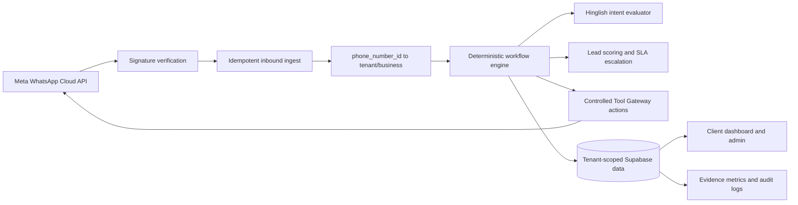

# XeroWA AI technical architecture

## Product boundary

XeroWA is the generic multi-business WhatsApp workflow product. `real_estate` is one tenant playbook/vertical. Standalone X7 RealEstate property management, colony/resident operations, finance, content-generation and credentials are not XeroWA dependencies.

## Logical architecture

## Components

| Component | Responsibility | Evidence | Boundary/limitation |
|---|---|---|---|
| Public landing | Product, innovation, evidence, pilot, privacy and grant-readiness information | `apps/landing` | Public; no tenant data |
| Dashboard | Tenant operator UI for chats, leads, calendar, knowledge, campaigns and settings | root Next.js routes/components | Requires authenticated runtime proof |
| Admin panel | Platform operator controls and selected-business administration | `src/app/admin`, admin APIs | Admin/client session proof pending |
| Webhook API | Meta verification, signature validation, persistence and deferred processing | root WhatsApp webhook route | Rate-limiting evidence pending |
| Summoner | Preferred central ingress, routing, orchestration and cron fan-out | `agents/xerowa-summoner` | Local/service runtime not re-deployed in this branch |
| Sales agent | Approved replies, knowledge, qualification, campaigns and follow-ups | `agents/xerowa-sales-agent` | Customer performance not measured |
| Tool Gateway | External action boundary for WhatsApp/media/payment helpers | `agents/xerowa-tool-gateway` | Vendor credentials stay server-side |
| Workflow engine | Schema-validated deterministic transitions and actions | `packages/workflow-engine` | Source-tested prototype |
| Intent engine | Configured Hinglish intent evaluation | `packages/intent-engine` | Synthetic development data |
| Lead scoring/escalation | Explainable score and owner alert SLA | packages and integration test | Simulation evidence only |
| Supabase/PostgreSQL | System of record, RLS, composite keys and audit logs | migrations/tests | Deployed migration state pending |

## Core data flow

1. Meta sends a webhook to the configured endpoint.
2. The server validates `X-Hub-Signature-256` using the exact body and server-only app secret.
3. Provider message/event identifiers prevent duplicate work.
4. `phone_number_id` resolves the business/tenant context.
5. The active tenant playbook evaluates the message and allowed next transition.
6. Approved actions send a reply, persist a lead, request an appointment, schedule follow-up or escalate to the owner.
7. Business/tenant data and audit records are persisted.
8. Authenticated dashboard/admin surfaces read the permitted business context.
9. Evidence metrics report values only when source data exists; empty samples return null/“Not yet measured.”

## Security boundaries

- Browser/user access: authenticated sessions and role checks.
- Tenant data: RLS plus tenant-bound composite keys in the new tenant schema.
- Provider ingress: signed webhook and idempotency.
- External actions: server-only secrets and Tool Gateway preference.
- Workflow audit: immutable transition records and atomic compare-and-swap commit.
- Public evidence: aggregate/anonymized artifacts only.

## Deployment boundary

The root dashboard/API and `apps/landing` are separate Next.js build roots. Agent services have independent health/dependency endpoints and local ports. Vercel project IDs/root directories and deployed SHAs must be recorded from the hosting control plane; they are not inferred from source.

## Known limitations

- Secure live RLS tests need staging credentials.
- Legacy generic business tables and the new tenant schema coexist.
- No public endpoint rate-limiting proof was found.
- Current screenshots/demo and deployment evidence are missing.
- No independent security certification exists.
